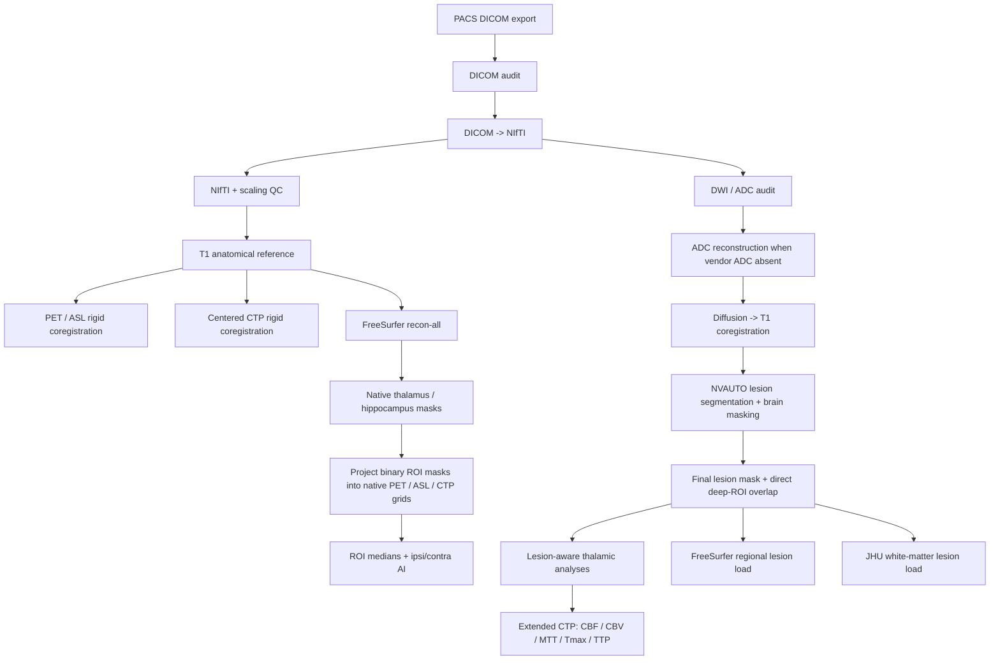

# PSE acute thalamic diaschisis multimodal imaging pipeline

Research code for the exploratory acute post-stroke thalamic diaschisis analysis developed within the PSE PET-MR project.

The pipeline starts from PACS-exported DICOM series and produces lesion-aware thalamic/hippocampal asymmetry measures across FDG-PET, ASL-CBF and CT-perfusion maps, together with acute infarct segmentation and exploratory lesion-topography analyses.

> **Research use only.** This repository is not a clinical diagnostic tool.

## Scientific scope

The acute pilot focused on homologous left/right **thalamic** and **hippocampal** regions of interest (ROIs) and calculated:

```text
ratio = ipsilateral / contralateral
AI    = (ipsilateral - contralateral) / (ipsilateral + contralateral)
```

A negative AI indicates a lower ipsilateral value. For CTP time maps (MTT/Tmax/TTP), a positive ipsilateral-minus-contralateral difference indicates longer ipsilateral transit/delay.

The final acute lesion method was:

```text
DWI b1000 + ADC
    -> ADC/DWI geometric harmonization
    -> FreeSurfer-derived brain mask
    -> zero extracerebral signal
    -> NVAUTO (stroke_segmentor)
    -> visual QC
    -> final binary lesion mask
```

**Important terminology:** the lesion model used in the final analysis is **NVAUTO** from the `stroke_segmentor` package. It is not the complete DeepISLES ensemble. Some historical local development folders contained the string `deepisles`; those names are not used in the cleaned public pipeline.

## Workflow



## Repository structure

```text
scripts/
  01_pacs_and_nifti/
  02_coregistration/
  03_freesurfer_rois/
  04_diffusion_and_lesion/
  05_analysis/
  setup/
data_templates/
config.example.sh
environment.yml
CITATION.cff
PROVENANCE.md
ZENODO_RELEASE_CHECKLIST.md
```

## Software used for the pilot

The pilot was developed/tested with:

- MATLAB R2026a
- SPM25
- FreeSurfer 8.2.0 (Apple Silicon)
- Python 3.11.16
- `stroke_segmentor` / NVAUTO
- NumPy, SciPy, NiBabel, Matplotlib
- FSL atlas data: MNI152 template and JHU ICBM-DTI-81 white-matter labels

Exact package versions should be frozen at the Zenodo release using a cleaned `conda env export --from-history` plus a portable package-version lock file from the analysis environment.

## Configuration

The public scripts do not contain user-specific absolute paths. Set the following environment variables before running the pipeline:

```bash
export PSE_ROOT="$HOME/PSE"
export SPM_DIR="$HOME/spm25"
export FREESURFER_HOME="/Applications/freesurfer/8.2.0"
export PSE_FSL_DATA_ENV="$HOME/miniforge3/envs/pse-fsl-data"
```

A template is provided in `config.example.sh`.

MATLAB scripts use `$PSE_ROOT` and, when relevant, `$SPM_DIR`. If `PSE_ROOT` is unset, they default to `~/PSE`.

Subject identifiers are **not hard-coded** in the public scripts. Subjects are discovered from local `sub-*` project directories or from the local stroke-side table, depending on the processing stage.

Visual lesion-QC decisions are also kept outside the public code. `PSE_FINALIZE_LESIONS_AND_ROI_OVERLAP_01.py` optionally reads a local `PSE_LESION_QC_DECISIONS.csv` (or the path supplied via `PSE_LESION_QC_FILE`). A generic template is provided in `data_templates/`; participant-level QC decisions should remain in the local/private analysis tree.

## Expected project layout

The pilot expects pseudonymized subject folders such as:

```text
<PSE_ROOT>/
  sub-PXXX/
    acute/
      T1/
      DWI/
      ADC/                 # if available
      FLAIR/
      PET_FDG/
      PET_FDG_QCLEAR/
      ASL_CBF/             # or one of the ASL source candidate folders
      CTP_REF/
      CTP_CBF/
      CTP_CBV/
      CTP_MTT/
      CTP_TMAX/
      CTP_TTP/
  derivatives/
```

No patient-level imaging or clinical data are included in this repository.

---

# Pipeline steps

## 1. PACS/DICOM audit and NIfTI conversion

### `PSE_DICOM_AUDIT_03.m`
Non-destructive audit of source DICOM metadata. Identifies expected modality folders and flags missing/unexpected content.

### `PSE_DICOM_TO_NIFTI_01.m`
Converts acute DICOM series to NIfTI using SPM. For ASL, it retains only DICOMs whose `ImageType` contains `PERFUSION_ASL`. Resting-state fMRI is deliberately excluded from the present ROI pipeline.

### `PSE_NIFTI_QC_01.m`
Checks dimensions, voxel sizes, finite/non-zero voxels, basic intensity statistics and creates visual montages.

### `PSE_INTENSITY_SCALING_AUDIT_01.m`
Audits DICOM scaling metadata for FDG-PET, ASL and CTP maps before quantitative ROI extraction.

**Pilot-specific note:** PET BQML scaling was retained. ASL units were not formally verified, so ASL was analyzed using relative left/right or ipsilateral/contralateral measures rather than interpreted as absolute CBF in mL/100 g/min.

## 2. Multimodal coregistration

### `PSE_COREG_ESTIMATE_01.m`
Rigid normalized-mutual-information coregistration of PET/ASL to the T1 reference. The quantitative images remain in their native voxel grids; the copied NIfTI affine headers are updated without resampling voxel intensities.

### `PSE_COREG_VISUAL_QC_01.m`
Visual QC for PET/ASL registration.

### `PSE_CTP_COREG_CENTERED_01.m`
CTP-specific registration. A geometric-center initialization is performed before rigid NMI estimation because the CTP/T1 origins can differ substantially.

### `PSE_CTP_VISUAL_QC_CENTERED_01.m` and `PSE_CTP_OVERLAY_QC_02.m`
Visual QC of CTP-to-T1 alignment.

## 3. FreeSurfer anatomy and ROI projection

### `PSE_FREESURFER_ACUTE_BATCH_02.sh`
Runs cross-sectional `recon-all` for all acute T1 scans found under the NIfTI derivatives. If T1 field-of-view exceeds 256 mm, `-cw256` is added. Existing complete subjects are skipped; partial subjects stop the batch for manual review.

### `PSE_FREESURFER_ROI_EXTRACT_02.m`
Extracts acute bilateral thalamic and hippocampal volumes from `aseg.stats` and reads eTIV.

FreeSurfer aseg labels used:

| Structure | Left | Right |
|---|---:|---:|
| Thalamus | 10 | 49 |
| Hippocampus | 17 | 53 |

### `PSE_FREESURFER_NATIVE_ROI_MASKS_02.sh`
Maps `aseg.mgz` back to the native anatomical (`rawavg`) grid and creates binary thalamic/hippocampal masks.

### `PSE_PROJECT_ROI_TO_MODALITIES_03.m`
Projects only **binary ROI masks** into the native quantitative PET/ASL/CTP grids using nearest-neighbour interpolation, then extracts ROI values and coverage. Quantitative images are not resampled for ROI extraction.

### `PSE_BUILD_ANALYSIS_READY_ROI_DATASET_01.m`
Builds long/wide analysis-ready tables and computes ipsilateral/contralateral measures after stroke side has been entered into the generated stroke-side CSV.

Primary coverage rule in the pilot:

- `<50%` paired ROI coverage: excluded from primary paired analysis
- `50-80%`: retained with warning
- `>=80%`: accepted

## 4. Diffusion and acute infarct segmentation

### `PSE_DIFFUSION_INPUT_AUDIT_01.m`
Audits available acute diffusion-related NIfTI files.

### `PSE_DIFFUSION_DICOM_AUDIT_02.m`
Reads source DICOM metadata to identify ADC/DWI series and b-values. In the pilot, this verified the b=0 and b=1000 source images when a vendor ADC map was absent.

### `PSE_RECONSTRUCT_ADC_FROM_DWI_01.m`
Automatically selects subjects with acute DWI data but no vendor ADC map. The public script preserves the pilot b=0/b=1000 filename mapping, but it must only be used after `PSE_DIFFUSION_DICOM_AUDIT_02.m` has verified the source-DICOM b-values for the local dataset.

Reconstructs ADC for subjects without a vendor ADC map using:

```text
ADC = -ln(Sb1000 / Sb0) / 1000
```

For the pilot PACS export, source-DICOM audit established that `DWI_002` was b=0 and `DWI_001` was b=1000 for these three cases. This mapping must not be assumed in another dataset without verification.

### `PSE_DIFFUSION_COREG_T1_02.m`
Uses ADC as the source image for rigid ADC-to-T1 NMI registration and applies the same header transform to the high-b DWI copy, preserving the DWI/ADC native grids.

### `PSE_DIFFUSION_COREG_QC_02.m`
Visual QC of diffusion/T1 registration.

### `PSE_NVAUTO_SEGMENTATION_FINAL.py`
Clean publication-facing implementation of the final infarct pipeline. It consolidates the exact logic of the harmonization and brain-masked NVAUTO steps used during development.

Key decisions:

- DWI is the reference grid.
- ADC is linearly resampled to the exact DWI grid.
- FreeSurfer aseg is projected to DWI with nearest-neighbour interpolation.
- The brain mask is hole-filled/closed/dilated **in plane only** to avoid clipping cortical lesion edges on thick diffusion slices.
- Extracerebral DWI/ADC values are set to zero.
- Negative DWI/ADC intensities are set to zero.
- NVAUTO is run with `force_cpu=True`.
- All final masks require visual QC against DWI and ADC.

Example:

```bash
conda activate pse-stroke
python scripts/04_diffusion_and_lesion/PSE_NVAUTO_SEGMENTATION_FINAL.py all
```

### `PSE_FINALIZE_LESIONS_AND_ROI_OVERLAP_01.py`
Promotes the visually accepted NVAUTO mask to the final lesion directory. For quantitative direct-ROI involvement, the **binary lesion mask** is resampled with nearest-neighbour interpolation into native T1/FreeSurfer space and intersected with the original aseg labels.

The script reports any overlap and >=1% / >=5% involvement. The manuscript pilot uses **>=1% ipsilateral thalamic overlap** as the main descriptive sensitivity threshold for direct thalamic involvement; it is not presented as a biological definition of diaschisis.

## 5. Acute lesion-aware analyses

### `PSE_ACUTE_PILOT_ANALYSIS_01.m`
Original exploratory descriptive summary of acute ROI asymmetry and modality concordance.

### `PSE_ACUTE_THALAMUS_LESION_AWARE_ANALYSIS_01.py`
Primary lesion-aware thalamic analysis for FDG-PET, ASL-CBF and CTP-CBF. Reports all subjects, thalamus-spared `<1%`, and a strict group with no ipsilateral thalamic/hippocampal lesion overlap.

### `PSE_ACUTE_THALAMUS_CTP_EXTENDED_01.py`
Extends thalamic CTP analysis to CBF, CBV, MTT, Tmax and TTP. Reports both AI and absolute ipsilateral-minus-contralateral differences.

### `PSE_ACUTE_THALAMUS_VOLUME_ASSOCIATION_01.py`
Descriptive Spearman association between final acute lesion volume and thalamic AI. No p-values are generated in the pilot.

### `PSE_LESION_TOPOGRAPHY_FREESURFER_01.py`
Projects the final binary lesion to native FreeSurfer `aparc+aseg` space and quantifies ipsilesional regional lesion load in caudate, putamen, pallidum/lentiform, thalamus, hippocampus, insula and broad cortical groups. Generates a patient-by-region heatmap and descriptive correlations with thalamic imaging measures.

### `PSE_JHU_WM_TOPOGRAPHY_01.py`
Registers the native FreeSurfer brain to MNI152 with SynthMorph, applies the same transform to the binary lesion using nearest-neighbour interpolation, and quantifies lesion load in JHU ICBM-DTI-81 white-matter regions:

- ALIC: anterior limb of internal capsule
- PLIC: posterior limb of internal capsule
- RLIC: retrolenticular internal capsule
- ACR: anterior corona radiata
- SCR: superior corona radiata
- PCR: posterior corona radiata
- PTR: posterior thalamic radiation
- EC: external capsule

Every native-to-MNI registration must be visually reviewed before interpreting tract lesion loads.

---

# Third-party NVAUTO setup

`stroke_segmentor` and its model weights are not redistributed here.

Two **version-specific workarounds** used on the Apple-Silicon pilot workstation are retained under `scripts/setup/` for provenance:

- `PSE_INSTALL_STROKE_SEGMENTOR_WEIGHTS_01.py`: workaround for a failing Zenodo archive endpoint by downloading the configured weight ZIP directly.
- `PSE_PATCH_STROKE_SEGMENTOR_CPU_LOAD_01.py`: changes `torch.jit.load(checkpoint)` to `torch.jit.load(checkpoint, map_location=self.device)` so CUDA-saved TorchScript models can load on CPU-only systems.

These scripts modify/download third-party package assets and should **only** be used if the same upstream problems are present. Prefer the current upstream installation instructions whenever possible.

# Analysis principles used in the pilot

1. **Native quantitative grids are preserved.** PET/ASL/CTP voxel values are not interpolated for ROI extraction; binary masks are projected with nearest-neighbour interpolation.
2. **Median ROI values are primary** because they are less sensitive to extreme voxels.
3. **Missing modalities remain missing (`NaN`)**; no complete-case restriction is imposed across modalities.
4. **No confirmatory inference is performed in the 7-subject pilot.** Medians, directional counts and Spearman rho values are descriptive only.
5. **Direct infarction is separated from remote dysfunction.** The thalamus-spared `<1%` subgroup is the main sensitivity analysis for the diaschisis question.
6. **Automated lesion segmentation is never accepted without visual QC.**
7. **ASL is treated as relative/asymmetry-based in this pilot** because absolute map units were not formally verified.

# Data privacy

The repository intentionally contains **code only**. Do not upload DICOM, NIfTI, FreeSurfer subject directories, lesion masks, clinical CSVs or other participant-level derivatives to a public repository unless explicitly permitted by the ethics/data-governance framework.

The supplied `.gitignore` blocks common neuroimaging and analysis file types by default.

# Reproducibility and citation

For a manuscript release:

1. create a GitHub release, e.g. `v1.0.0`;
2. archive that exact release on Zenodo;
3. obtain the Zenodo DOI;
4. add the DOI to `CITATION.cff` and the manuscript Data Availability Statement;
5. do not alter the archived release after submission—make later changes in a new version.

Suggested manuscript wording:

> Custom analysis code used for image preprocessing, ROI extraction, lesion segmentation and lesion-topography analyses is publicly available on GitHub and archived in a versioned Zenodo release (DOI: to be added). Individual-level neuroimaging data are not publicly available because of participant privacy and institutional data-protection requirements.

# Maintainer

Vincent Leclercq, Hôpital Erasme / Université libre de Bruxelles, Brussels, Belgium.
